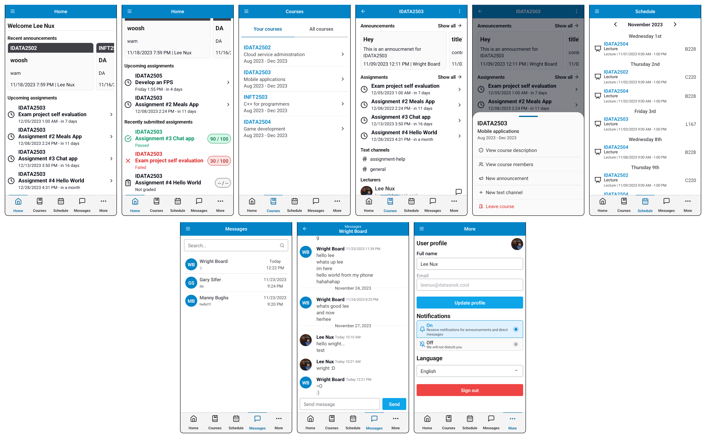

<h3 align="center">idata2503-project</h3>
<p align="center">Examination project for the course IDATA2503 Mobile applications at NTNU</p>

## Useful resources

- [Use case diagram](docs/diagrams/use-cases.drawio.svg)
- [ER diagram](docs/diagrams/er-diagram.drawio.svg)
- [Hierarchy diagram](docs/diagrams/hierarchy.drawio.svg)
- [Figma wireframe](https://www.figma.com/file/bxtclztaQN2EbRWWXXD8Kh/Wireframe?type=design&node-id=0-1&mode=design)
- [Design guidelines](docs/DESIGN.md)
- [Methodology & meeting minutes](docs/METHOD.md)

## Showcase



See [full showcase](https://www.figma.com/file/bxtclztaQN2EbRWWXXD8Kh/Wireframe?type=design&node-id=836%3A733&mode=design&t=og1wpWwoxlbpacWc-1) for more screenshots.

## Architecture

The following figure shows a rough overview of the backend architecture of the application.


The backend is based on Supabase and uses their database, authentication and realtime services.
To handle push notifications OneSignal is used.

- [Supabase Auth](https://supabase.io/docs/guides/auth)
- [Supabase Database](https://supabase.com/docs/guides/database)
- [Supabase Realtime](https://supabase.com/docs/guides/realtime)
- [Supabase Vault](https://supabase.com/docs/guides/database/vault)
- [OneSignal](https://documentation.onesignal.com/docs)

## Contributing

### Prerequisites

- [Node.js](https://nodejs.org/)
- [PNPM](https://pnpm.io/)
- Android or iOS emulator/device ([Windows Subsystem for Android][wsa], [Android Virtual Device][avd] or similar)
- A [Supabase](https://supabase.com/) project
- A [OneSignal](https://onesignal.com/) project (optional, required for Push notifications)

Note: To use a real device you need to install [Expo Go](https://expo.dev/client)

[wsa]: https://docs.microsoft.com/en-us/windows/android/wsa/
[avd]: https://developer.android.com/studio/run/managing-avds

### Project structure

```bash
├───docs            # documentation
├───src
│   ├───app         # routes/screens
│   ├───components  # shared components
│   ├───i18n        # translations
│   ├───icon        # icon helpers
│   ├───services    # services
│   ├───store       # state
│   └───util        # utilities
└───supabase        # supabase project
    └───migrations  # database migrations (DDL)
```

### Code style

Code should be formatted using [Prettier](https://prettier.io/) and the provided configuration file.

### Getting started

1. Clone the repository
2. Install dependencies with `pnpm install`
3. Set environment variables in `.env` (see [`.env.example`](.env.example))
4. Start the development server with `pnpm start`

You can start using Expo Go or a development client by postfixing the start command using `-g` for Expo Go, and `-d` for a development client.

If you start with a new Supabase project, you need to run the migrations and seed the database manually.
For our project migrations are run in GitHub Actions.

Running the migrations can be done by running the following command:

```bash
pnpm supabase db push
```

### Supabase OneSignal integration

To enable push notifications you need to add a few secrets to the Supabase project.
This can be accomplished through running the following commands in the query console:

```sql
SELECT vault.create_secret('onesignal_token', 'token');
SELECT vault.create_secret('onesignal_app_id', 'app_id');
```

See their [docs](https://supabase.com/docs/guides/database/vault) for more information.
